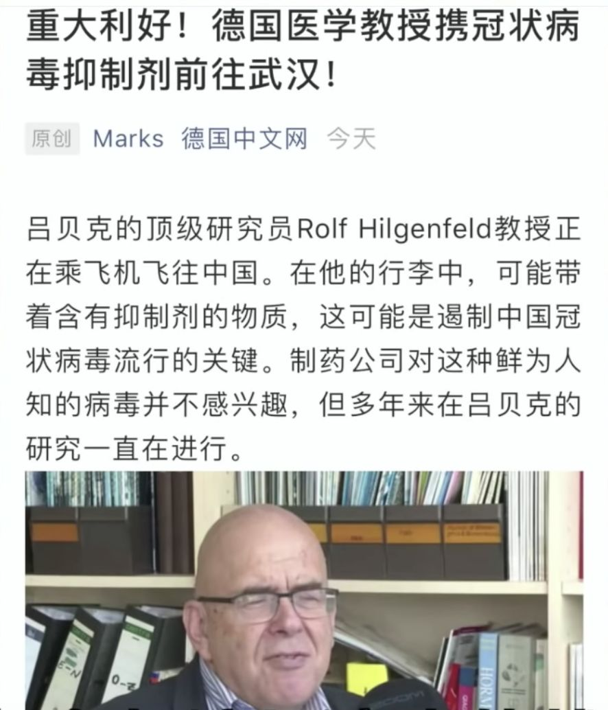

早在22号新闻就说有位来自德国吕贝克大学的冠状病毒研究专家带着抑制病毒的药来华帮忙了。当时看到这条新闻感觉到一丝欣慰。

  

  

  

  

最近一位德国小伙也看到了他这位德国同胞的新闻，于是就试着去采访了一下老爷子，老爷子已经在中国了，来听听他说了什么吧，本文的最后有他们的采访视频。  

  

  

**非常感觉这位同际友人对我们的帮忙，也希望他的箱子里正装着能够解决我们问题的答案！武汉加油！**
