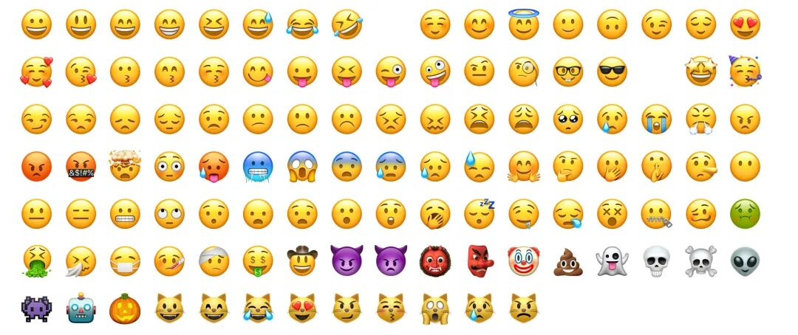
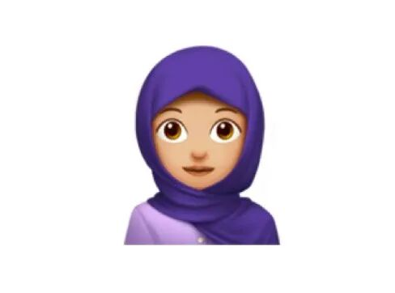
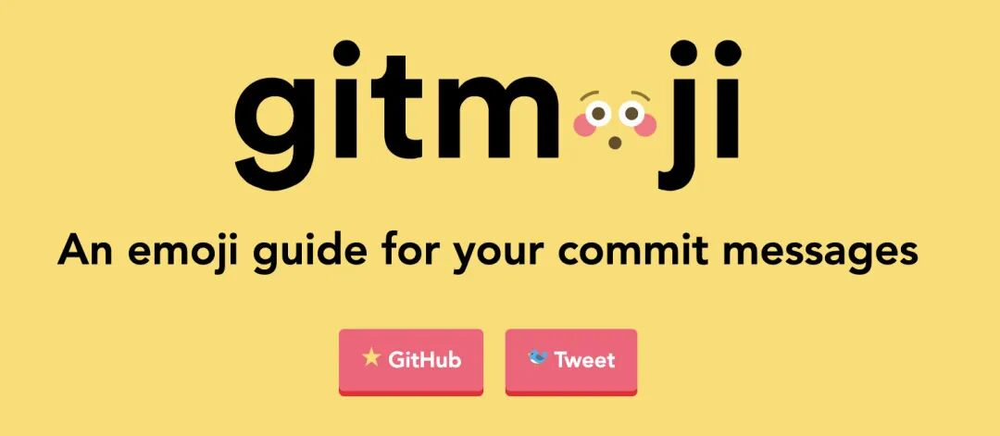
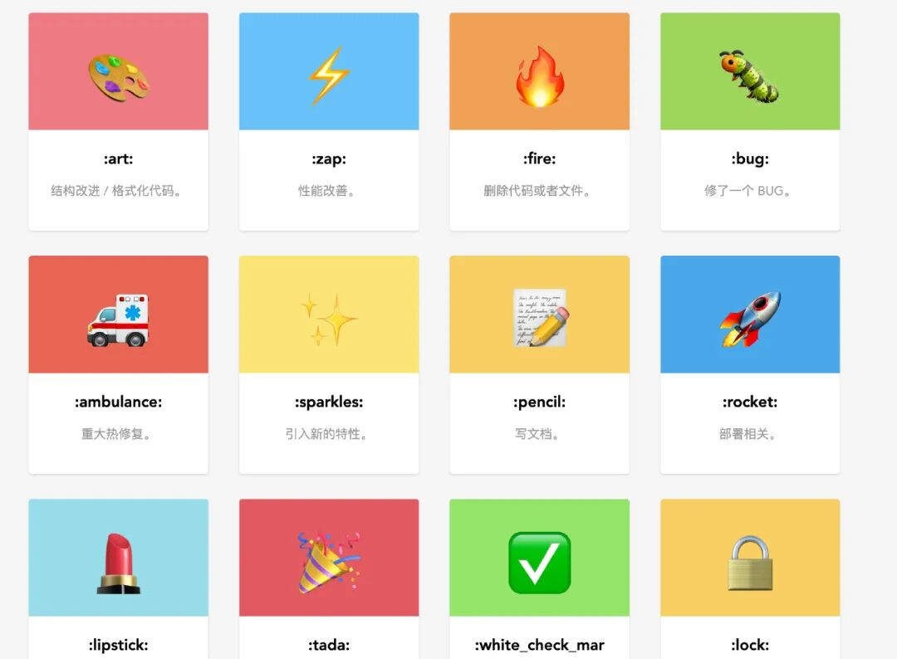
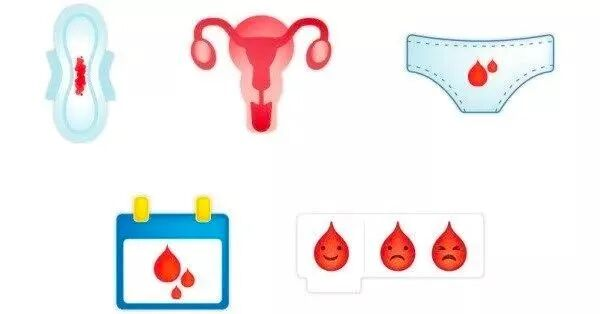

emoji 大家都在用，就是各种表情，可是它为什么叫 `emoji`呢，查了下英文的词典没看出个所以然来，于是查了一下中文维基百科：

> “
> 
> Emoji（日语：絵文字／えもじ emoji），是使用在网页和聊天中的形意符号，最初是日本在无线通信中所使用的视觉情感符号。表情意指面部表情，图标则是图形标志的意思，可用来代表多种表情，如笑脸表示笑、蛋糕表示食物等。在香港除“表情图标”外，也有称作“绘文字”或“emoji”。在台湾 LINE 软件中，表情符号又被叫做“表情贴”。在中国大陆，表情符号通常直称“emoji”或称“表情符号”。新马即“绘文字”或直接称“emoji”
> 
> ”

好像 emoji 是个日语单词的感觉，再查下英文的维基百科

> “
> 
> An emoji (/ɪˈmoʊdʒiː/ i-MOH-jee; plural emoji or emojis) is a pictogram, logogram, ideogram or smiley embedded in text and used in electronic messages and web pages. The primary function of emoji is to fill in emotional cues otherwise missing from typed conversation. Some examples of emoji are 😂, 😃, 🧘🏻‍♂️, 🌍, 🌦️, 🍞, 🚗, 📞, 🎉, ❤️, 🍆, 🏁, among many others. Emoji exist in various genres, including facial expressions, common objects, places and types of weather, and animals. They are much like emoticons, but emoji are pictures rather than typographic approximations; the term "emoji" in the strict sense refers to such pictures which can be represented as encoded characters, but it is sometimes applied to messaging stickers by extension.Originally meaning pictograph, the word emoji comes from Japanese e （絵，'picture') + moji （文字，'character'); the resemblance to the English words emotion and emoticon is purely coincidental. The ISO 15924 script code for emoji is Zsye.
> 
> ”

**the word emoji comes from Japanese e （絵，'picture') + moji （文字，'character')**

明确了，它就是从日文来的，而且是两个词合起来的，我们去词典软件听一下日文原音

连发音都一模一样，看来 emoji 就是从日文音译过去的，类似中文的 Kongfu（功夫）😁

这里还有一部讲 emoji 的纪录片，感兴趣的可能找资源看一下，不过很遗憾，国内我是没找到。

## 其他

  

emoji 有的也是有人物原型的，比如  🧕🏻

如果你想提交自己设计的 `emoji` 可以看一下 Unicode 的指南：https://unicode.org/emoji/proposals.html#selection\_factors

### 编程

我们在代码提交的时候也可以加入 `emoji` , 这样可以让读者更直观地知道要表达的大致内容方向。

`gitmoji` 是一个标准化和解释在 `GitHub` 提交消息上使用 `emoji` 的倡议。`gitmoji` 是一个开源项目，专门规定了在 `github` 提交代码时应当遵循的 `emoji` 规范

> “
> 
> 在执行 git commit 指令时使用 emoji图标为本次提交添加一个特别的图标， 这个本次提交的记录很容易突出重点，或者说光看图标就知道本次提交的目的。这样就方便在日后查看历史提交日子记录中快速的查找到对于的提交版本。由于有很多不同的表情符号，表情库更新后，没有一个可以帮助更轻松地使用表情符号的中文表情库列表。所以这里主要列出 gitmoji项目中规定的emoji规范的表情符号列表。
> 
> ”

### 语言

`emoji` 会成为新时代的 “语言”吗？

不知道，但在语言之外的表达上（如情绪），`emoji` 其实已经超越语言了，无论你使用的是英语、汉语、日语还是其他什么语言，都能看懂 `emoji`，因为它是图形，一图胜千言。

### for girls

2017年的一项调查强调，在英国，月经给女性带来羞耻感。随后，英国国际计划组织发起了一项争取经期表情符号的活动，这个新表情符号由此而来。对于“月经表情”，英国国际计划组织起初提供了五个方案，分别是卫生巾、月历（即带有血滴的日历）、微笑/难过的血滴、子宫、经期内裤，这五个方案的共同特点都是红色的血滴。

最终网友投票选出了“经期内裤”这一方案前去送审，不过，负责为表情包编码并对其实施管理职能的 Unicode **拒绝**了这个方案。

官方给的理由是 🩸已经能表达这个意思了，不需要再添加一个新的。

英国国际计划组织**没有就此放弃**，而于去年再次提交了新一版“月经表情”申请：一滴红色的液体。这个设计是该组织与英国国家医疗服务体系的血液与移植中心合作完成的。

**这个表情包可以表达全球8亿女性每个月都在经历的事情，加入这个表情是将月经正常化和打破其污名的重要一步。**

一个表情包并不能解决这些问题，但它确实能帮助改变人们的讨论。从开放讨论一步步解除人们对于月经的羞耻感。

试想，如果你的女儿正经历月经初潮，可能不懂或者不好意思表达，但她需要你的帮助，你也不好意思问，如果有这样一个表情，可能家长就能 “心领神会”，就能避免一些问题的发生。

### 数量

`emoji` 会越来越多吗？

随着时间的推移，更多的 `emoji` 提交被审核通过。

`emoji` 越多越好吗？

不是的，想像一下，你手机里如果有成千上万个 `emoji` 你还会从里面挑选吗，这太麻烦了，而且我们日常用的也就是那一小部分。

## 参考

-   https://gitmoji.js.org/
-   https://hooj0.github.io/git-emoji-guide/
-   https://language.chinadaily.com.cn/a/201903/02/WS5c79d590a3106c65c34ec4d6.html
