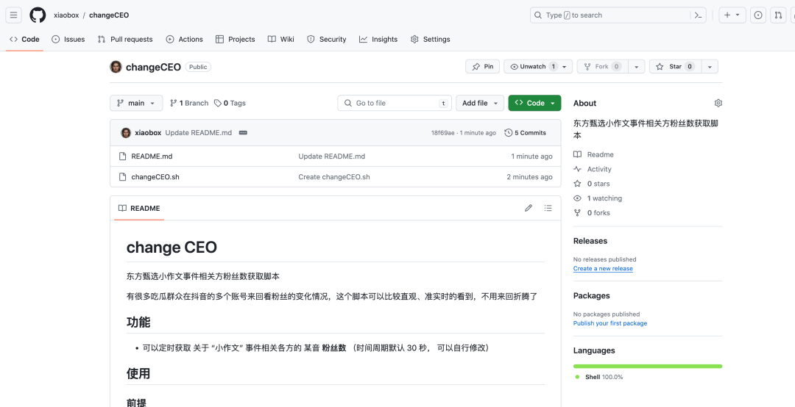
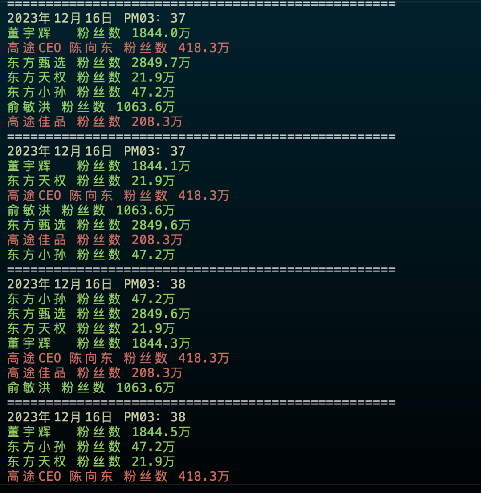

关于 “小作文” 事件 写了个脚本方便大家吃瓜

这两天有关 东方甄选的 “小作文” 事件闹得沸沸扬扬，各路吃瓜群众络绎不绝地到某音上吃瓜，我像很多人一样在各个账号之间来回切换，这边看看粉丝掉了多少，那边看看粉丝涨了多少，好不辛苦。于是就想写个程序方便吃瓜。

https://github.com/xiaobox/changeCEO

脚本比较简单，就是定时获取事件相关方账号的粉丝数量

效果如下：

由于吃瓜有时效性，我写的这会儿 CEO 都免职了，所以程序就没写的那么完美，大家凑合用吧。

不说了，我去看看 董宇辉涨到多少粉儿了～～
