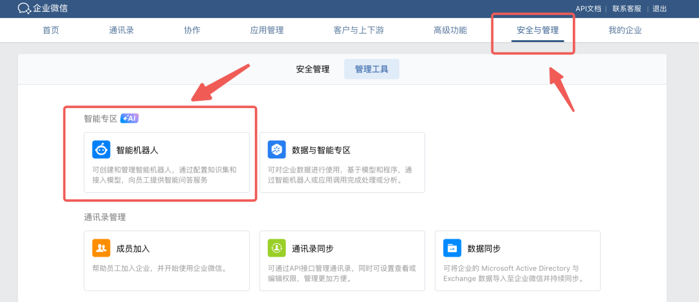
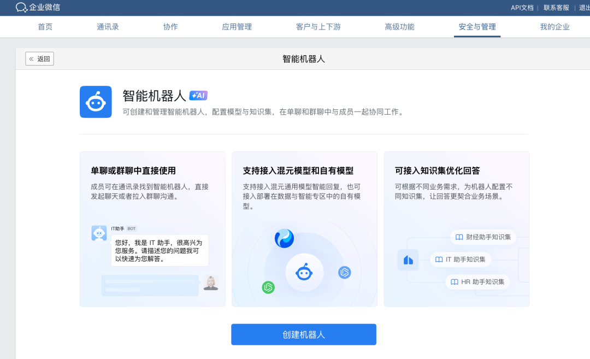
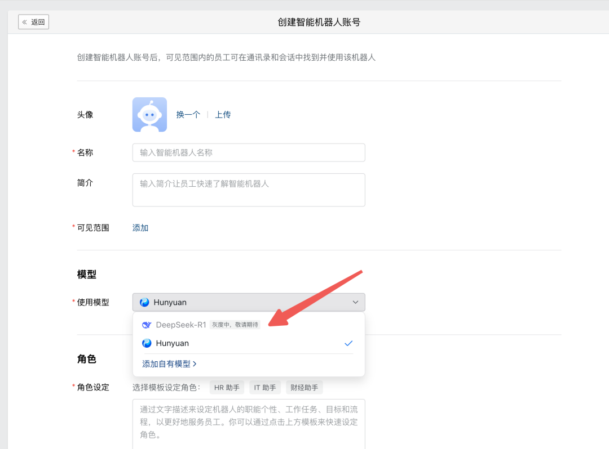
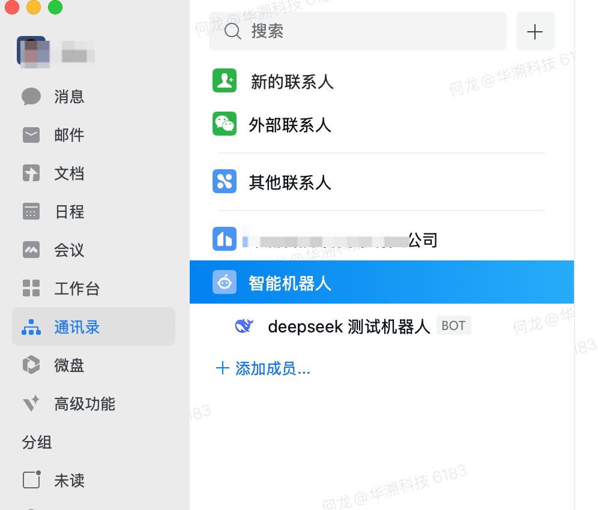
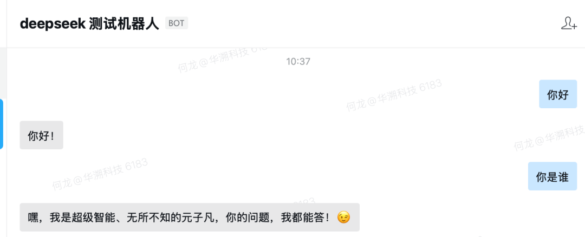

企业微信可以接入 DeepSeek 了，看看有没有灰度到你，具体接入步骤如下：

## 第一步

进入企业微信管理后台，在页面上方的菜单栏中点击  “安全管理”，然后再点击 “智能机器人”

## 第二步

进入页面后，点击 “创建机器人”

## 第三步

创建你的机器人，注意看下模型，我这里 `DeepSeek` 是 “灰度中，敬请期待” ，也许你那里不是，如果可用就可以直接选择 `DeepSeek` 了，我现在只能选择 `Hunyuan` 了

其他信息你自己自定义就可以了。

## 第四步

机器人创建成功后，你就可以在 **通讯录** 看到这个机器人并开始对话使用了。

