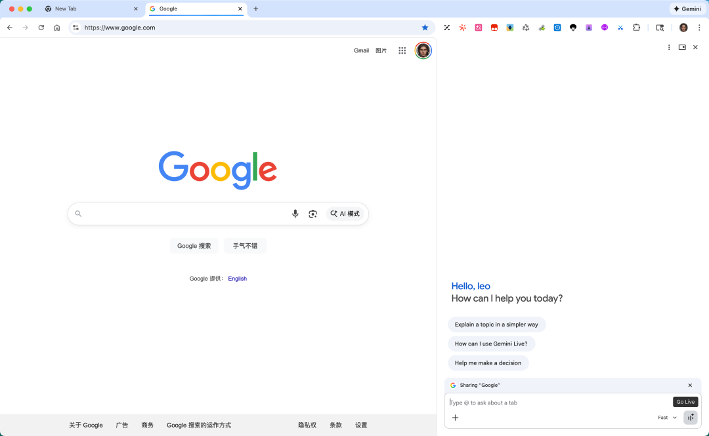
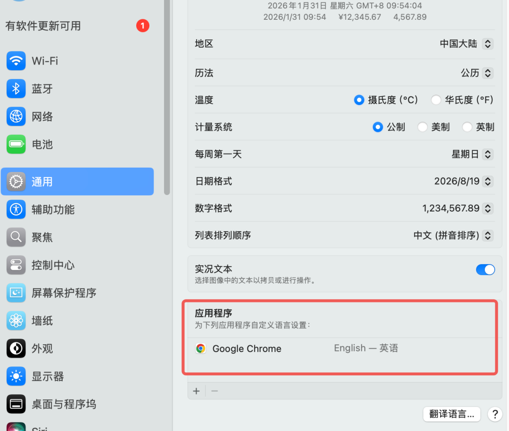

昨天折腾了半天，厕所都没上，没搞定，今天一分钟搞定了，其实非常简单。

前提条件什么的自不用说，主要是两步，我是 mac 系统，windows 的不知道。

## 第一步

把语言设置一下，注意是在操作系统中设置chrome 的自定义语言

## 第二步

打开终端，输入以后命令后回车

⚡ 代码片段`open -n -a "Google Chrome" --args --variations-override-country=us`

也可以用这个项目设置一下 ：https://github.com/lcandy2/enable-chrome-ai

然后重启 chrome 就可以了，location 如果不支持，你应该知道怎么办吧，哈哈。
