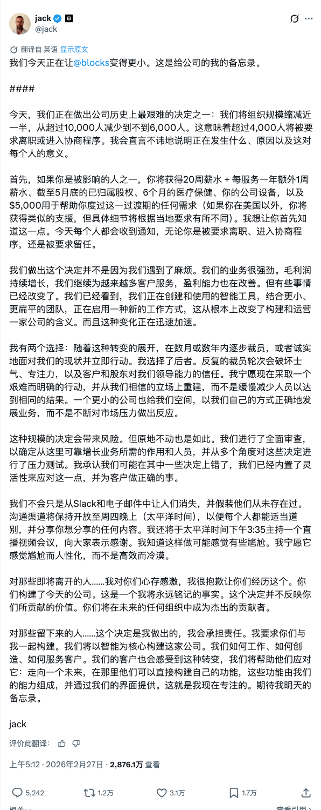

Square和Cash App的母公司周四宣布将裁减超过4,000个岗位——接近其一半员工,这可能是迄今为止一家大型公司围绕人工智能进行重组最明确的案例。CEO杰克·多西在X平台上发帖称,此次裁员将使员工人数从超过10,000人减少至不到6,000人。他将这一决定定位为对更精简、由AI驱动的运营模式的主动押注,而非对财务困境的回应。

投资者对这一激进的成本削减举措以及强劲的第四季度业绩表示认可,公司股价在盘后交易中飙升超过20%。
